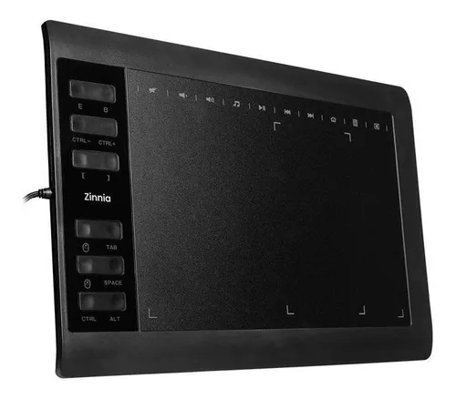

# T501 Drawing Tablet Linux Driver

Linux userspace driver for the SZ PENG YI LTD. T501 drawing tablet (`08f2:6811`).

## Elavator Pitch

Unlock full drawing area of your graphics tablet on Linux



## Problem

I bought one of these drawing tablets the other day and it worked great, but there was one issue that was ruining my experience: on Linux specifically, the writing/drawing area is limited to the inner drawing rectangle on the tablet surface, making me squeeze my hand in it when there is a huge unused space that I could use.

After seeing that it shows up as a "Wacom" tablet in the Ubuntu "Settings" panel, I started doing some research and found out that these are made by a white-labeling company, so I believe there should be tons of brands out there that corresponds to the same tablet model.

To test that this was a Linux-only issue I connected the tablet to a Windows computer and the full area start working right away.

## Solution

I installed Wireshark on the Windows machine and captured every packet exchanged over the USB port that the tablet was connected to. Then I used the captured info to build the [tablet-init.py](./tablet-init.py) script, that sends the same HID signals that were sent on Windows and also created the [install.sh](./install.sh) script that installs the tablet-init.py locally and places a udev rule to automatically

## Installation

```bash
sudo ./install.sh
```

This copies `tablet-init.py` to `/usr/local/bin/` and installs a udev rule that runs it automatically whenever the tablet is plugged in.

## Manual usage

```bash
sudo python3 tablet-init.py
```

## How it works

1. `tablet-init.py` locates the tablet's hidraw device for HID interface 2
2. Sends a sequence of HID SET_FEATURE reports (report ID `0x08`) that configure the tablet firmware to use the full digitizer area
3. The udev rule triggers this script on every USB hotplug event for the tablet

## Uninstall

```bash
sudo rm /usr/local/bin/tablet-init.py /etc/udev/rules.d/99-tablet-t501.rules
sudo udevadm control --reload-rules
```
